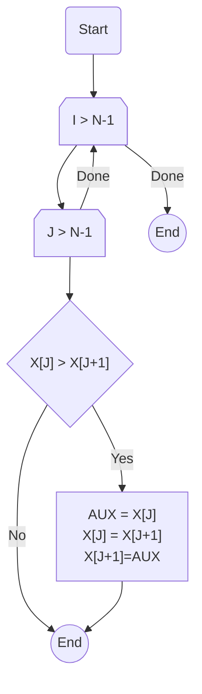

# Bubble Sort

The basic idea of Bubble Sort is to swap the values of two elements, `A[i]` and `A[i+1]`. For this, we need an `aux` variable to temporarily store the value of `A[i]`, so we can move the larger value to the last position in the array.

We use two loops: the inner loop is responsible for comparing and swapping values, and the outer loop ensures that we repeat this operation for the number of elements in the array.

